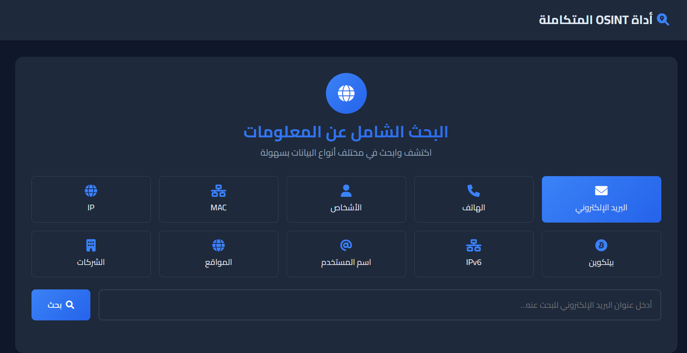

# 🔍 OSENT Search | أداة البحث الاستخباراتي المفتوح

<div dir="rtl">

## 🌟 نظرة عامة
OSENT Search هي أداة قوية للبحث الاستخباراتي مفتوح المصدر (OSINT) تتيح للمستخدمين جمع وتحليل المعلومات من مصادر متعددة بواجهة عربية سهلة الاستخدام.



### ✨ المميزات الرئيسية

#### 🔍 خيارات البحث المتعددة
- **البحث عن البريد الإلكتروني 📧**
  - فحص وجود الحساب على منصات التواصل الاجتماعي
  - البحث عن تسريبات البيانات
  - البحث في قواعد بيانات WikiLeaks
  - تحليل البريد الإلكتروني

- **البحث عن أرقام الهواتف 📱**
  - تحديد الدولة والمنطقة
  - معلومات شركة الاتصالات
  - البحث عن الحسابات المرتبطة
  - فحص تطبيقات المراسلة

- **البحث عن الأشخاص 👤**
  - البحث في الشبكات الاجتماعية
  - البحث عن الصور المرتبطة
  - المعلومات الشخصية المتاحة
  - الروابط والحسابات المرتبطة

- **البحث عن عناوين MAC 🌐**
  - تحديد الشركة المصنعة
  - نوع الجهاز
  - معلومات الشبكة

- **البحث عن عناوين IP 🔍**
  - تحديد الموقع الجغرافي
  - معلومات مزود الخدمة
  - فحص القوائم السوداء
  - تحليل سمعة العنوان

- **البحث عن محافظ البيتكوين ₿**
  - تتبع المعاملات
  - تحليل الرصيد
  - العناوين المرتبطة
  - تاريخ المعاملات

- **البحث عن عناوين IPv6 🌍**
  - تحديد نطاق الشبكة
  - معلومات التسجيل
  - تحليل البنية التحتية

- **البحث عن أسماء المستخدمين 🔎**
  - البحث عبر المنصات المختلفة
  - تحليل أنماط الاستخدام
  - ربط الحسابات المتعددة
  - تاريخ النشاط

- **البحث عن المواقع 🌐**
  - معلومات الخادم والاستضافة
  - تسجيلات دخول العملاء والموظفين
  - عناوين البريد الإلكتروني للشركة
  - النطاقات الفرعية

- **البحث عن الشركات 🏢**
  - معلومات السجل التجاري
  - بيانات الموظفين
  - العلاقات التجارية
  - التقارير المالية

### 💫 مميزات تقنية
- واجهة مستخدم عربية سهلة الاستخدام
- تصميم متجاوب يعمل على جميع الأجهزة
- دعم الوضع المظلم/الفاتح
- معالجة متوازية للطلبات
- تنسيق النتائج بشكل منظم وجميل
- حماية وتشفير البيانات الحساسة

### 🚀 كيفية البدء

#### متطلبات النظام
- Python 3.8+
- متصفح حديث
- اتصال إنترنت

#### التثبيت
1. استنسخ المستودع:
```bash
git clone https://github.com/yourusername/OSENT-Search.git
```

2. انتقل إلى مجلد المشروع:
```bash
cd OSENT-Search
```

3. قم بتثبيت المتطلبات:
```bash
pip install -r requirements.txt
```

4. قم بتشغيل التطبيق:
```bash
python app.py
```

5. افتح المتصفح على العنوان:
```
http://localhost:5000
```

### 🛡️ الخصوصية والأمان
- تشفير جميع البيانات المنقولة
- عدم تخزين أي معلومات حساسة
- احترام سياسات الخصوصية للمنصات
- تقييد معدل الطلبات لمنع إساءة الاستخدام

### 📝 المساهمة
نرحب بمساهماتكم! إذا كنت ترغب في المساهمة:
1. افتح Issue جديد
2. قم بعمل Fork للمشروع
3. أنشئ فرع جديد لميزتك
4. قم بإرسال Pull Request

### 📜 الترخيص
هذا المشروع مرخص تحت رخصة MIT - انظر ملف [LICENSE](LICENSE) للتفاصيل.


</div>

---

# 🔍 OSENT Search | Open Source Intelligence Tool

## 🌟 Overview
OSENT Search is a powerful Open Source Intelligence (OSINT) tool that enables users to gather and analyze information from multiple sources with an Arabic-friendly interface.

### ✨ Key Features

#### 🔍 Multiple Search Options
- **Email Search**
  - Social media account verification
  - Data breach checks
  - WikiLeaks database search
  - Email analysis

- **Phone Number Search**
  - Country and region identification
  - Carrier information
  - Associated accounts
  - Messaging apps verification

- **Person Search**
  - Social network search
  - Image search
  - Available personal information
  - Linked accounts

- **MAC Address Search**
  - Manufacturer identification
  - Device type
  - Network information

- **IP Address Search**
  - Geolocation
  - ISP information
  - Blacklist check
  - Reputation analysis

- **Bitcoin Wallet Search**
  - Transaction tracking
  - Balance analysis
  - Linked addresses
  - Transaction history

- **IPv6 Address Search**
  - Network range identification
  - Registration information
  - Infrastructure analysis

- **Username Search**
  - Cross-platform search
  - Usage pattern analysis
  - Multiple account linking
  - Activity history

- **Website Search**
  - Server and hosting information
  - Client and employee logins
  - Company email addresses
  - Subdomains

- **Company Search**
  - Business registry information
  - Employee data
  - Business relationships
  - Financial reports

### 💫 Technical Features
- Arabic-friendly user interface
- Responsive design for all devices
- Dark/Light mode support
- Parallel request processing
- Well-formatted results
- Sensitive data protection

### 🚀 Getting Started

#### System Requirements
- Python 3.8+
- Modern web browser
- Internet connection

#### Installation
1. Clone the repository:
```bash
git clone https://github.com/yourusername/OSENT-Search.git
```

2. Navigate to project directory:
```bash
cd OSENT-Search
```

3. Install requirements:
```bash
pip install -r requirements.txt
```

4. Run the application:
```bash
python app.py
```

5. Open browser at:
```
http://localhost:5000
```

### 🛡️ Privacy & Security
- All transmitted data is encrypted
- No sensitive information storage
- Respect for platform privacy policies
- Rate limiting to prevent abuse

### 📝 Contributing
Contributions are welcome! If you'd like to contribute:
1. Open a new Issue
2. Fork the project
3. Create a feature branch
4. Submit a Pull Request

### 📜 License
This project is licensed under the MIT License - see the [LICENSE](LICENSE) file for details.
